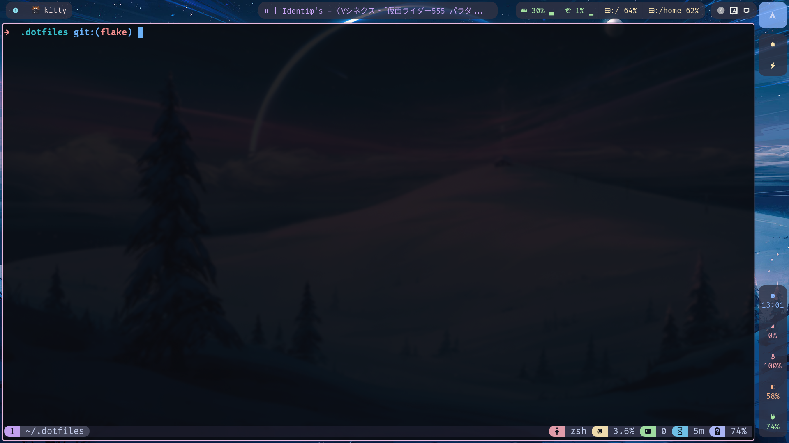

# .dotfiles



## Prerequisite

### Require

- `hyprland`
- `hyprlock`

### Optional

- `NetworkManager`
- `cups`
- `blueman`
- `ufw`
- `sbctl`
- `tuned-ppd`
- `hyprpolkitagent`

## Installation

### Clone the repos

```bash
git clone git@github:TranThangBin/.dotfiles $HOME/.dotfiles
cd $HOME/.dotfiles
```

### Install nix (if you don't already have)

```bash
curl -L https://nixos.org/nix/install | sh -s -- --daemon
```

### You are ready

```bash
nix --extra-experimental-features "nix-command flakes" run home-manager/master -- switch --flake $HOME/.dotfiles --impure
```

Relaunch your shell and we can use `home-manager --flake $DOTFILES_DIR switch --impure` in future rebuild

## About Nvidia GPU

### Install Nvidia driver

Follow the guide from [korvahannu/arch-nvidia-drivers-installation-guide](https://github.com/korvahannu/arch-nvidia-drivers-installation-guide)

### Post installation

#### For Nvidia GPU

Follow [this](https://download.nvidia.com/XFree86/Linux-x86_64/435.17/README/powermanagement.html) document.

Enable these services:

```bash
sudo systemctl enable nvidia-suspend.service
sudo systemctl enable nvidia-hibernate.service
sudo systemctl enable nvidia-resume.service
```

#### ufw

Follow [this](https://youtu.be/QxNsyrftJ8I) video by `Chris Titus Tech`.

```bash
sudo ufw limit 22/tcp
sudo ufw allow 80/tcp
sudo ufw allow 443/tcp
sudo ufw default deny incoming
sudo default allow outgoing
```
